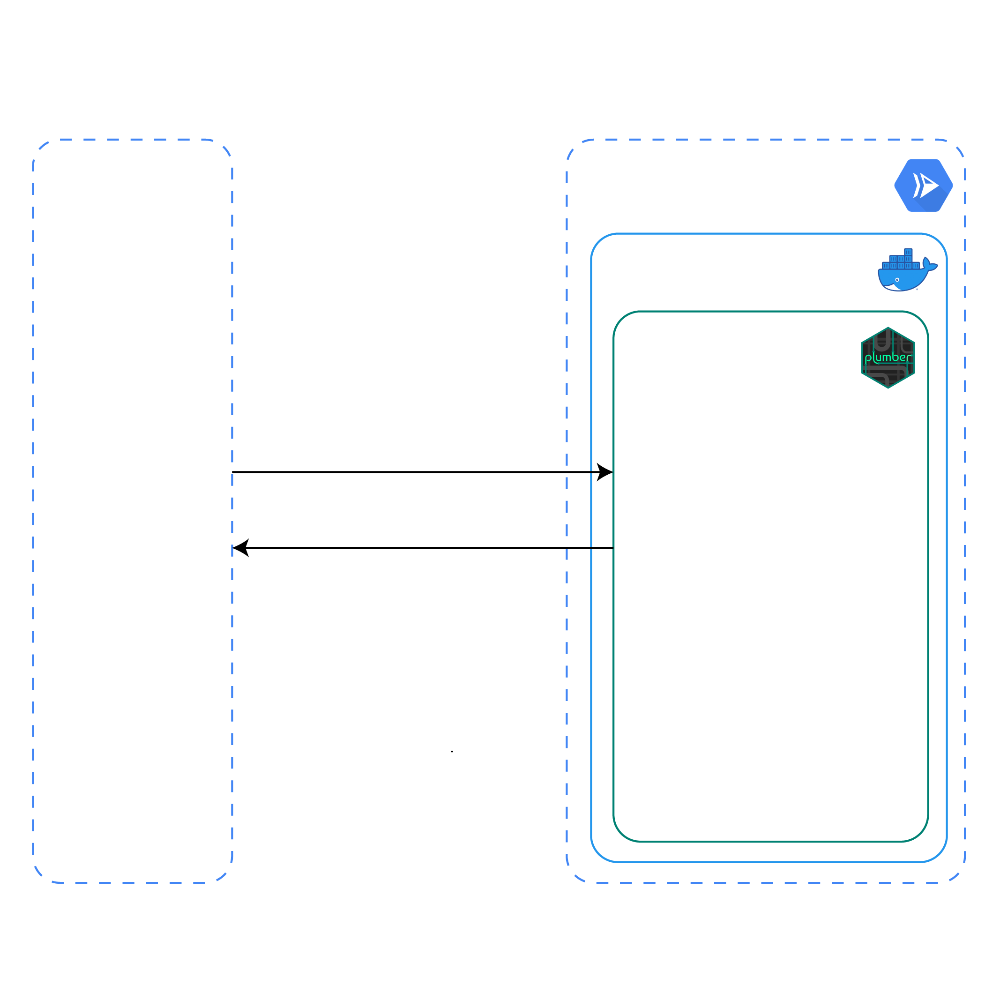

<!-- README.md is generated from README.Rmd. Please edit that file -->

# Serverless Scraping Service

<!-- badges: start -->

[](https://lifecycle.r-lib.org/articles/stages.html#experimental)
[](https://github.com/data-for-good-concepts/eurostat-scraper/actions/workflows/deploy-cloudrun.yaml)
[](https://github.com/data-for-good-concepts/eurostat-scraper/actions/workflows/dry-run-docker-build.yaml)

<!-- badges: end -->

## Overview

> ⚠️ *Please note, that the documentation of this project is still
> **Work In Progress**. The description might be incomplete and is
> subject to constant change.*

This example scrapes the *‘Asylum applicants by type of applicant,
citizenship, age and sex - monthly data’* from the [**Eurostat Data
Browser**](https://ec.europa.eu/eurostat/databrowser/view/MIGR_ASYAPPCTZM/default/table?lang=en).
The scraper can be triggered with a `POST` request to an API endpoint,
which returns the scraped data as the `response`. Even though this
example has been developed to scrape one particular dataset, any other
dataset that is available as part of the **Eurostat Data Browser** can
be scraped with little to no adjustments.

The **Eurostat Scraper** is a working example on how to wrap a web
scraper in a web service and deploy it on the cloud using R. This
project aims to showcase different aspects when it comes to web scraping
in general, as well as different technologies when deploying your work
in production.

All this might sound good to you and you probably still wonder, why wrap
a scraper in a web service? The reason is, having your application
wrapped in a web service makes it accessible, easy to interact and easy
to intergrate into other applications. You can communicate with this
application through a `REST` API, which is possible using any modern
programming language.

## Architecture

<p align="center">

</p>

## Prerequisites

- In order to run this service locally, you need to have a
  [Firefox](https://www.mozilla.org/) client installed on your machine.
- In order to deploy this image on Google Cloud, you will need a [Google
  Cloud Account](https://cloud.google.com/) and a project.
- You then also must [enable the Cloud Build
  API](https://console.cloud.google.com/apis/library/cloudbuild.googleapis.com)
  as well and [enable the Cloud Run
  API](https://console.cloud.google.com/apis/library/run.googleapis.com).
- To deploy this service from the command line you need to install
  [gcloud CLI](https://cloud.google.com/sdk/docs/install).
- To deploy this service using `GitHub Actions` you need to export
  `Service  Account` credentials. See [Using GitHub
  Actions](#using-github-actions) for more information.

When using a depolyed version of this project, you don’t need to worry
about the `Firefox` client, as it will be installed as part of the
`Docker` image. Further, following tools and technologies will be
highlighted or are heavily in use as part of this concept - `RSelenium`,
`plumber`, `Docker`, `Google Cloud Build`, `Google Cloud Run` and
`GitHub Actions`.

## Usage

In order to launch the scraping service locally, install the necessary
dependencies and start the web service by executing following commands
in your R console.

``` r
renv::restore()
source('src/server.R')
```

### Trigger scraping job

Start a scraping job by making a `POST` request to the trigger endpoint.
When you are working locally, replace `<URL>` with `localhost:8080`.
When you have the web service deployed on Google Cloud Run, use your
Cloud Run service URL.

``` bash
# bash
curl --location --request POST '<URL>/api/v1/scraper/job' \
--header 'Content-Type: application/json' \
--data-raw '{
   "url": "https://ec.europa.eu/eurostat/databrowser/view/MIGR_ASYAPPCTZM/default/table?lang=en",
   "dataset":[
      {
         "dimension":"Age class",
         "filter":[
            "[Y18-34]",
            "[Y35-64]",
            "[Y_GE65]"
         ]
      },
      {
         "dimension":"Country of citizenship",
         "filter":[
            "[UA]"
         ]
      }
   ]
}'
```

``` r
# R
httr::POST(
  '<URL>/api/v1/scraper/job', 
  body = list(
           url = "https://ec.europa.eu/eurostat/databrowser/view/MIGR_ASYAPPCTZM/default/table?lang=en",
           dataset = list(
                       list(
                         dimension = 'Age class', 
                         filter    = list('[Y_LT14]', '[Y14-17]')
                       ),
                       list(
                         dimension = 'Country of citizenship',
                         filter    = list('[UA]')
                       )
                     )
         ),
  encode = "json"
)
```

As a response the scraping service will return the requested dataset as
`JSON`.

``` js
[
    {
        "DATAFLOW": "ESTAT:MIGR_ASYAPPCTZM(1.0)",
        "LAST UPDATE": "11/11/22 23:00:00",
        "freq": "M",
        "unit": "PER",
        "citizen": "UA",
        "sex": true,
        "age": "Y18-34",
        "asyl_app": "ASY_APP",
        "geo": "AT",
        "TIME_PERIOD": "2021-12",
        "OBS_VALUE": 0
    },
    {
        "DATAFLOW": "ESTAT:MIGR_ASYAPPCTZM(1.0)",
        "LAST UPDATE": "11/11/22 23:00:00",
        "freq": "M",
        "unit": "PER",
        "citizen": "UA",
        "sex": true,
        "age": "Y18-34",
        "asyl_app": "ASY_APP",
        "geo": "AT",
        "TIME_PERIOD": "2022-01",
        "OBS_VALUE": 0
    },
    ...
]
```

## Deployment

> ℹ️️️️️ *Documentation on IAM permissions need to be added. Further
> documentation on Service Account usage and permissions is currently
> missing.*

The following steps will walk you through the steps to create a `build`
of this project using
[`Google Cloud Build`](https://cloud.google.com/build/docs/overview#:~:text=Cloud%20Build%20is%20a%20service,Docker%20containers%20or%20Java%20archives.)
and then deploy it on
[`Google Cloud Run`](https://cloud.google.com/run/docs/overview/what-is-cloud-run).

In case you want to modify deployment parameters, feel free to adjust
the `cloudbuild.yaml` according to your needs.

### Using the terminal

Once `gcloud CLI` is installed, execute the following command in the
terminal in order to login to your Googgle Account and to authenticate
subsequent commands to deploy your service on Google Cloud. This command
will open a browser prompt that will ask you to `Sign in with Google`
and to grant `Google Cloud SDK` access to your Google account.

``` bash
gcloud auth login
```

Set the project in which the web service is deployed to. Make sure to
replace `PROJECT_ID` with your own project id.

``` bash
gcloud config set project <PROJECT_ID>
```

You can then deploy this service on Google Cloud by executing the
following command. Make sure to replace `<REGION>` with the [Google
Cloud region](https://cloud.google.com/compute/docs/regions-zones), you
want to use for the deployment of your web service.

``` bash
gcloud builds submit --region='<REGION>'
```

You can see the logs of the build in the [Cloud Build
History](https://console.cloud.google.com/cloud-build). In case you
don’t see your `build`, make sure you have selected your region in the
dropdown. When deploying for the first time, the build process can take
up-to 25min. Subsequent deployments should be done in less than 5min, as
we then make use of `cached` Docker images. Once the build is done, you
will see your deployment on the [Cloud Run
Overview](https://console.cloud.google.com/run).

### Using GitHub Actions

The `GitHub Actions` workflow in this project is setup in a way, that
with every `push` to the `main` branch the `deploy-cloudrun` workflow
will be triggered. That workflow will automatically build the image in
`Cloud Build` and deploy it on `Cloud Run`.

``` yaml
name: deploy-cloudrun
on:
  push:
    branches:
      - 'main'
...
```

The `deploy-cloudrun` workflow uses the `google-github-actions/auth@v1`
with a `Service Account JSON key` to authenticate with Google Cloud. The
`JSON` key is stored as a Github secret and is named `GC_SA_ADMNIN_KEY`.

``` yaml
- name: 'Authenticate GCP 🔐'
  id: 'auth'
  uses: 'google-github-actions/auth@v1'
  with:
    credentials_json: '${{ secrets.GC_SA_ADMNIN_KEY }}'
```

Once the workflow is done, you will see your deployment on the [Cloud
Run Overview](https://console.cloud.google.com/run).

------------------------------------------------------------------------

Please note that this project is released with a [Contributor Code of
Conduct](CODE_OF_CONDUCT.md). By participating in this project you agree
to abide by its terms.
