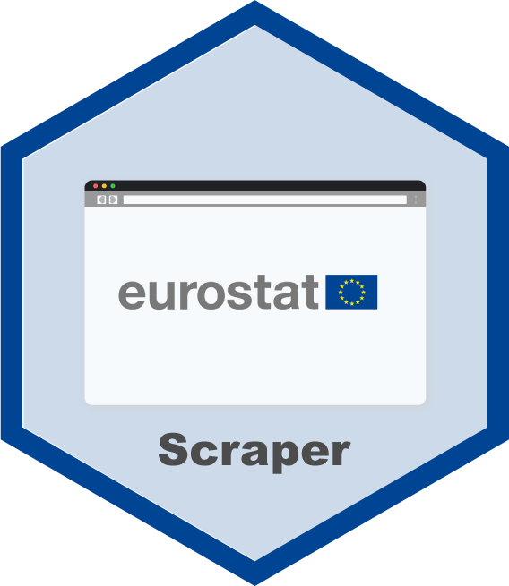

<!-- README.md is generated from README.Rmd. Please edit that file -->

# Eurostat Scraper 

<!-- badges: start -->

[](https://lifecycle.r-lib.org/articles/stages.html#experimental)
[](https://github.com/data-for-good-concepts/eurostat-scraper/actions/workflows/deploy-cloudrun.yaml)

<!-- badges: end -->

> *⚠️ Please note, that the documentation of this project is still
> **Work In Progress**. The description might be incomplete and is
> subject to constant change.*

The **Eurostat Scraper** is a working example on how to wrap a web
scraper in a web service and deploy it on the cloud.

### Prerequisites

Before you get started, make sure you are familiar with the following
packages and tools.

#### Development

Apart from R packages that are very commen (e.g. tidyverse, etc.) this
project heavily relies on the following two packages.

- [RSelenium](https://docs.ropensci.org/RSelenium/)  
- [plumber](https://www.rplumber.io/)

Please make yourself familiar with these packages, as it will be a lot
easier to understand the code, once you know what these packages do and
how they work.

#### Production

In order to run this web service on Google Cloud, please make sure you
have a [Google Cloud Account](https://cloud.google.com/) and that you
are familiar with the tools that we will use for deployment.

- [Docker](https://docker-curriculum.com/)  
- [GitHub
  Actions](https://github.blog/2022-06-03-a-beginners-guide-to-ci-cd-and-automation-on-github/)
- [gcloud CL](https://cloud.google.com/sdk/gcloud)  
- [Google Cloud Service
  Account](https://cloud.google.com/iam/docs/service-accounts)  
- [Google Cloud
  Build](https://cloud.google.com/build/docs/overview#:~:text=Cloud%20Build%20is%20a%20service,Docker%20containers%20or%20Java%20archives.)  
- [Google Cloud
  Run](https://cloud.google.com/run/docs/overview/what-is-cloud-run)

### Getting started

#### Development

``` r
source('src/server.R')
```

#### Deployment

Replace `<REGION>` with the [Google Cloud
region](https://cloud.google.com/compute/docs/regions-zones), you want
to use for the deployment of your web service.

``` bash
gcloud builds submit --region='<REGION>'
```

### Usage

### Code of Conduct
